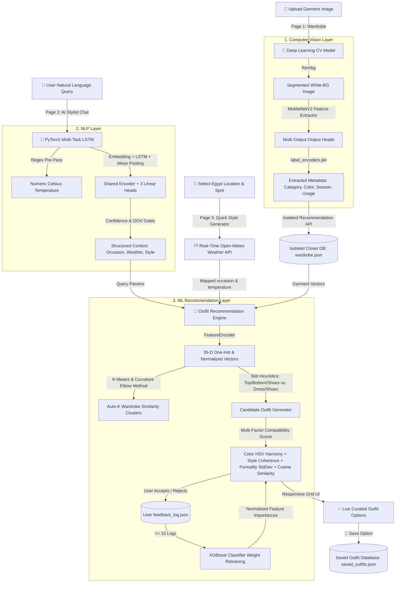

# Technical Architecture & System Report
## Project Title: **Enta Nazel Keda? (✨ Cairo's AI Luxury Fashion Assistant)**
**Course:** Machine Learning Project (Year 3, Term 2)  
**Status:** Fully Integrated & Verified (100% Passing Tests)

---

## 1. Executive Summary & Architecture Overview
**Enta Nazel Keda?** (Egyptian Arabic for *"Are you going out like that?"*) is an end-to-end, multi-user, AI-powered luxury fashion styling application. It enables users to digitalize their physical wardrobes by uploading garment photos, interact with a conversational AI stylist in natural language, and receive highly personalized, weather-appropriate, and color-compatible outfit combinations.

The system is split into three major architectural layers (Computer Vision, Natural Language Processing, and Recommendation Engine) tied together by a secure, multi-page, beige-and-gold themed Streamlit web application.

### 📐 High-Level Architecture Flowchart



---

## 2. Component Role Allocations & Contributor Breakdown
The development of the system is structured around three core roles, allocating tasks systematically to ensure clean module boundaries and seamless integration:

### 👤 Person 1: Computer Vision & Preprocessing Expert
*   **Module Ownership:** `vision/` directory.
*   **Key Deliverables:** 
    *   Development and training of the Deep Learning Computer Vision (CV) model (`vision_multi_output_model.keras`).
    *   Garment background segmentation pipeline using `rembg` to remove room noise, hangers, and shadows, pasting the isolated item on a pure white background.
    *   Multi-output classification pipeline extracting five fine-grained metadata dimensions simultaneously from a single forward pass.
    *   Label encoders deserializer (`label_encoders.pkl`) and mappings.
    *   Category mapper wrapper (`VisionModel.analyze`) that bridges fine-grained predictions to recommendation slots.

### 👤 Person 2: Recommendation Engine & ML Architect
*   **Module Ownership:** `recommendation_engine/` directory.
*   **Key Deliverables:**
    *   Data models and enums (`data_models.py`) defining wardrobe slots and attributes.
    *   Feature Encoder (`feature_encoder.py`) converting arbitrary garment attributes into structured 35-dimensional dense numeric vectors.
    *   K-Means Style Clusterer (`clustering.py`) grouping garments into similarity nodes with automatic $K$-selection via the Elbow Method.
    *   Multi-factor compatibility scorer (`compatibility.py`) evaluating outfits based on HSV color harmony, style coherence, formality standard deviation, and cosine similarity.
    *   Slot-based outfit generation (`outfit_generator.py`) combining tops + bottoms + shoes (standard) or dresses + shoes (dress-outfit), while explicitly preventing invalid combinations (e.g. dress + pants).
    *   Feedback manager (`feedback.py`) utilizing an **XGBoost Classifier** to learn personalized weighting parameters directly from user accept/reject choices.
    *   H&M global catalog ingestion and data converter (`convert_hm.py`).

### 👤 Person 3: NLP, Dialogue Systems & UI Integrator
*   **Module Ownership:** `nlp/` directory, `main.py`, and `Frontend/` folder.
*   **Key Deliverables:**
    *   PyTorch Multi-Task LSTM parser model (`WardrobeNLPModel`) that processes conversational user queries.
    *   Mean-pooling recurrent layers, separate ignore-index loss heads, OOV guards, and regex-based explicit temperature parsers (`dataset.py`, `model.py`, `train.py`, `inference.py`).
    *   Dialogue Orchestrator state machine (`WardrobeChatbot` in `main.py`) managing dialogue states (`AWAITING_QUERY`, `CLARIFICATION_NEEDED`, `SHOWING_RESULTS`).
    *   Rule-based pre-filters that intercept user rejection/feedback phrases before they corrupt the NLP model's states.
    *   Streamlit multi-page frontend framework, custom SHA-256 secure user registration/login, user-directory isolation, cached resources, and CSS styling sheets.

---

## 3. Technology Stack Breakdown
The system uses a modern, high-performance machine learning and web development stack:

| Layer | Technology Used | Purpose |
|---|---|---|
| **Computer Vision** | TensorFlow, Keras, Pillow (PIL), MobileNetV2 | Core image classification backbone and preprocessing. |
| **CV Segmentation** | Rembg (OnnxRuntime) | Background removal to isolate garments on white backdrops. |
| **Natural Language**| PyTorch (1.12+), Regex | Custom multi-task LSTM network training, word tokenization, and temperature regex. |
| **Clustering & Sim** | Scikit-Learn | Cosine similarity, K-Means clustering, and label encoders. |
| **Feedback Learning**| XGBoost | Personalizing scoring weights by training on user accept/reject actions. |
| **Data Handling**   | Pandas, NumPy, JSON | Dataframe manipulations, vector operations, and wardrobe serialization. |
| **Web UI**          | Streamlit (1.30+) | High-end luxury multi-page frontend app. |
| **Styling**         | Vanilla HTML5 & CSS3 | Curating a light beige and dark gold aesthetic with custom card layouts. |
| **API Connectors**  | Urllib (std library) | Fetching real-time weather from the Open-Meteo forecasting API. |

---

## 4. Technical Deep Dive: The Machine Learning Under the Hood

### 🖼️ 4.1. Deep Learning Computer Vision (CNN) — *Person 1*
When a user drops an image into their wardrobe, a multi-stage deep learning pipeline processes the image:

```
[Uploaded Image File] 
       │
       ▼
[rembg Segmenter] ──► Removes background and noise, masks garment onto white background
       │
       ▼
[Resize to 224x224] ──► Preprocessed with MobileNetV2 scaling ([-1, 1])
       │
       ▼
[MobileNetV2 Backbone] ──► 2D Convolutional layers extract rich image feature maps
       │
       ▼
[5 Parallel Dense Heads] ──► Softmax activations predict category, color, season, usage
       │
       ▼
[label_encoders.pkl] ──► Inverse transforms indices to human labels (e.g. "Base Colour: Navy Blue")
       │
       ▼
[Category Mapper] ──► Maps "Blouse" -> "shirt", "Saree" -> "dress", "Sneaker" -> "shoes"
```

*   **Noise Reduction Segmentation:** By using `rembg` (powered by U-2-Net), the system extracts the clothing item from messy background pixels. This isolates the garment, preventing bedroom clutter or human skin tones from confusing the convolutional layers.
*   **MobileNetV2 Backbone:** MobileNetV2 is selected due to its lightweight depthwise separable convolutions, making it extremely fast for local inference without compromising classification depth.
*   **Multi-Output Heads:** Instead of running 5 separate networks, a single MobileNetV2 feature extractor feeds 5 parallel output branches (dense classification layers) trained jointly. This minimizes memory overhead:
    1.  `subCategory` (e.g., Topwear, Bottomwear, Footwear)
    2.  `articleType` (e.g., Tshirt, Jeans, Blazer, Heels)
    3.  `baseColour` (e.g., Black, Red, Olive Green, Grey)
    4.  `season` (e.g., Summer, Winter, Spring, Autumn)
    5.  `usage` (e.g., Casual, Formal, Sport, Smart Casual)

---

### 🧠 4.2. PyTorch Natural Language Processing (Multi-Task LSTM) — *Person 3*
Rather than relying on basic string matching, the conversational interface uses a custom-trained neural network implemented in PyTorch (`WardrobeNLPModel`).

#### 📐 Network Topology
1.  **Preprocessing & Tokenization:** Lowercases text, strips punctuation/numbers, and splits into clean token words.
2.  **Embedding Layer:** Maps each token index to a dense 64-dimensional space (`vocab_size x 64`).
3.  **LSTM Layer (Recurrent Network):** A unidirectional LSTM with a 128-dimensional hidden state processes the sequence word-by-word, retaining contextual dependencies across the input string.
4.  **Mean Pooling Over Sequence:** Rather than passing only the *last hidden state* of the LSTM (which is heavily biased toward the end of the query and forgets keywords like "wedding" or "formal" placed at the beginning of long sentences), the network pools (averages) the hidden states across all token positions. This guarantees equal weight is given to every word.
5.  **Multi-Task Classification Heads:** The pooled vector feeds into three independent linear classification branches:
    *   `occasion_head` (Linear layer mapping to 6 classes)
    *   `weather_head` (Linear layer mapping to 3 classes)
    *   `style_head` (Linear layer mapping to 6 classes)

#### 🛡️ Robustness Guards & Heuristics
*   **Regex Pre-Pass:** If a user specifies an explicit temperature (e.g., *"it's -5 degrees"* or *"it is 85 degrees Fahrenheit"*), the regex parser extracts, parses, and converts it (to Celsius) before the model runs, completely overriding the weather neural branch.
*   **OOV (Out-Of-Vocabulary) Guard:** If more than 60% of input words are unknown (not in `vocab.pkl`), the chatbot bypasses the model and returns `None` immediately, preventing random hallucinations on junk inputs.
*   **Confidence Threshold Gates:** Softmax outputs must pass strict confidence thresholds: Occasion ($\ge 0.25$), Weather ($\ge 0.35$), and Style ($\ge 0.30$). If a branch's confidence is lower, it returns `None`, indicating the user did not specify that detail.
*   **Ignore Index Losses:** The model is trained using three cross-entropy losses utilizing `ignore_index=-100`. This allows the heads to be trained on incomplete training samples (e.g. occasion-only sentences) without penalizing the other heads.

---

### 👑 4.3. Outfit Recommendation Engine — *Person 2*

#### 🔢 Dense Vector Representation
Every wardrobe garment is mapped by `FeatureEncoder` into a deterministic **35-dimensional dense feature vector**:
*   **Category (8 dims):** One-hot representation of `shirt`, `pants`, `shorts`, `skirt`, `dress`, `shoes`, `jacket`, `accessory`.
*   **Color RGB (3 dims):** Red, Green, Blue parameters scaled between $[0.0, 1.0]$.
*   **Pattern (6 dims):** One-hot encoding of `solid`, `striped`, `plaid`, `floral`, etc.
*   **Style (6 dims):** One-hot encoding of `classic`, `streetwear`, `bohemian`, `minimalist`, `preppy`, `athletic`.
*   **Occasions (6 dims):** Multi-hot encoding (items can belong to multiple occasions).
*   **Seasons (4 dims):** Multi-hot encoding (items can fit spring, summer, autumn, and/or winter).
*   **Warmth & Formality (2 dims):** Normalized scales from $1-5 \rightarrow [0.0, 1.0]$.

####  Elbow Method K-Means Clustering
To keep large wardrobes organized, the engine fits a `KMeans` clusterer over the 35-D vectors. The optimal cluster size $K$ is selected dynamically via the **Elbow Method**:
1.  It fits models from $K=2 \dots 10$.
2.  It records the **inertia** (sum of squared distances to closest centroids).
3.  A curvature heuristic finds the "elbow" — the exact $K$ where the *drop* in inertia is less than 50% of the previous drop.
4.  This isolates outfits into style clusters automatically!

#### 📐 Multi-Factor Compatibility Scoring
Outfit combinations are scored on a strict $[0.0, 1.0]$ range by evaluating four sub-metrics (weighted equally at $25\%$ by default):

1.  **Color Harmony (HSV Domain):**
    *   RGB is converted to HSV. Low-saturation items (saturation $< 0.15$) represent neutrals (black, white, grey, beige) and are rewarded with high compatibility scores since they pair easily.
    *   Hues ($\Delta \text{hue}$) are evaluated pairwise:
        *   **Analogous Hues ($\Delta \text{hue} \le 30^\circ$):** Highly harmonious, rewarded with a score of `1.0`.
        *   **Semi-Analogous Hues ($\Delta \text{hue} \le 60^\circ$):** Highly scored at `0.85`.
        *   **Complementary Hues ($150^\circ \le \Delta \text{hue} \le 180^\circ$):** Bold but pleasant, scored at `0.90`.
        *   **Triadic-ish Hues ($120^\circ \le \Delta \text{hue} < 150^\circ$):** Scored at `0.75`.
        *   **Clashing Hues:** Given `0.50` (penalized).
2.  **Style Coherence:** The fraction of items in the outfit sharing the most-common style (e.g., if 2 out of 3 pieces are "streetwear", the score is $2/3 \approx 0.67$).
3.  **Formality Matching:** Computes the standard deviation of formality levels ($1-5$) across all items. The score is mapped: $\text{Score} = 1.0 - (\text{std\_dev} / 2.0)$ (where $2.0$ is the max possible standard deviation). This prevents pairing sport shorts with a formal blazer.
4.  **Cosine Feature Similarity:** Calculated as the average pairwise cosine similarity of the encoded feature vectors, ensuring the structural fabrics and cuts match organically.

---

### 📈 4.4. XGBoost Feedback Retraining Loop — *Person 2*
A major highlight of this system is its ability to learn and adapt to the user's specific fashion tastes. 

```
[Recommendation Engine] ──► Curates & Scores Outfits
       ▲                              │
       │                              ▼
[Update Scorer Weights]     [User accepts or rejects outfit]
       ▲                              │
       │                              ▼
[Feature Importances]       [Save Outfit ID + Action + 4 Sub-scores in JSON]
       ▲                              │
       │                              ▼
[XGBoost Classifier] ◄── [Accumulate >= 10 user actions with diverse classes]
```

1.  **Feedback Logging:** Every time a user clicks **Accept** (or saves an outfit) or **Reject** (typing *"I don't like these"* in chat), the system logs the event in `feedback_log.json`. It saves the action ($1$ for accept, $0$ for reject) and the 4 sub-scores (`color`, `style`, `formality`, `similarity`) as feature columns.
2.  **XGBoost Retraining:** Once the user logs $\ge 10$ interactions containing at least one positive and one negative action, the engine initializes an `XGBClassifier` (falling back to a Scikit-Learn `RandomForestClassifier` if XGBoost is missing).
3.  **Feature Importance Mapping:** The model is trained to predict the accept/reject action from the 4 sub-scores. After training, it extracts the **Feature Importances** of the 4 inputs.
4.  **Weight Re-balancing:** These importances are normalized to sum to $1.0$ and are assigned as the new scoring weights in `CompatibilityScorer`. 
    *   *Example:* If a user repeatedly rejects outfits with clashing styles but accepts bold colors, the XGBoost model detects that the `style` sub-score is the primary predictor of rejections, and assigns it a higher weight (e.g. $55\%$), while reducing the weight of `color` (e.g. $15\%$). Subsequent outfit generation will prioritize style coherence over color matching!

---

### 📍 4.5. Real-Time Open-Meteo & Egypt Spots Integration — *Person 3*
To make the AI stylist incredibly realistic, the system loads a database of actual Egyptian locations (`egypt_places_dummy.csv`), including tourist spots, local parks, cafes, historical mosques, and gym venues in Cairo.

1.  **Occasion Mapping:** When the user selects a spot (e.g. *"Al-Azhar Mosque"* or *"Giza Pyramids"*), the system resolves its category and automatically maps it to a recommendation occasion:
    *   `mosque` / `museum` $\rightarrow$ `formal`
    *   `gym` / `spa` $\rightarrow$ `sport`
    *   `night_club` $\rightarrow$ `party`
    *   `hotel` / `restaurant` $\rightarrow$ `business`
    *   `park` / `beach` / `shopping_mall` / `cafe` $\rightarrow$ `casual`
2.  **API Coordinates Fetching:** It fetches the latitude and longitude of the chosen spot.
3.  **Real-Time Weather Query:** It builds an HTTP request to the live **Open-Meteo API** to get current coordinates weather:
    *   The temperature is extracted.
    *   Weather codes (WMO standards) are mapped to conditions (e.g. code $0 \rightarrow$ `"sunny"`, codes $50-69 \rightarrow$ `"rainy"`).
4.  **Wardrobe Temperature Band Mapping:** The Celsius reading is mapped into target warmth levels:
    *   $\le 5^\circ\text{C}$ (Winter) $\rightarrow$ Warmth levels $4-5$.
    *   $6-15^\circ\text{C}$ (Autumn/Spring) $\rightarrow$ Warmth levels $3-4$.
    *   $16-24^\circ\text{C}$ (Spring/Autumn) $\rightarrow$ Warmth levels $2-3$.
    *   $\ge 25^\circ\text{C}$ (Summer) $\rightarrow$ Warmth levels $1-2$.
5.  **Strict vs. Relaxed Weather Filters:**
    *   *Strict Pass:* Items must lie within the exact warmth range and match the current season.
    *   *Relaxed Pass (Fallback):* If strict filtering yields fewer than 3 items, the system relaxes warmth constraints to $\pm 1$ level to find fits.
    *   *Last Resort:* If still empty, it sorts all wardrobe items by absolute closeness to the target warmth, ensuring shorts never appear in freezing weather.

---

## 5. Directory & File System Map: Where to Find Everything

This tree details the file layout. Double-click or open any path via file link.

*   📂 `c:\Users\judye\OneDrive\Desktop\uni\Year 3\Term 2\ML Project\` *(Project Root)*
    *   📄 [main.py](file:///c:/Users/judye/OneDrive/Desktop/uni/Year%203/Term%202/ML%20Project/main.py) — The main terminal orchestrator and dialogue state manager (`WardrobeChatbot`).
    *   📄 [populate_wardrobe.py](file:///c:/Users/judye/OneDrive/Desktop/uni/Year%203/Term%202/ML%20Project/populate_wardrobe.py) — Script to map vision predictions to wardrobe JSON and populate closet with offline outfit photos.
    *   📄 [requirements.txt](file:///c:/Users/judye/OneDrive/Desktop/uni/Year%203/Term%202/ML%20Project/requirements.txt) — Project packages (TensorFlow, PyTorch, XGBoost, Streamlit, Rembg).
    *   📂 [Frontend/](file:///c:/Users/judye/OneDrive/Desktop/uni/Year%203/Term%202/ML%20Project/Frontend) *(Streamlit User Interface)*
        *   📄 [Home.py](file:///c:/Users/judye/OneDrive/Desktop/uni/Year%203/Term%202/ML%20Project/Frontend/Home.py) — Streamlit homepage. Houses custom CSS, fonts, and luxury cards navigation.
        *   📄 [utils.py](file:///c:/Users/judye/OneDrive/Desktop/uni/Year%203/Term%202/ML%20Project/Frontend/utils.py) — User auth (SHA-256), folder isolation setup, saved outfits CRUD, lazy model caching, sidebar loader.
        *   📂 [pages/](file:///c:/Users/judye/OneDrive/Desktop/uni/Year%203/Term%202/ML%20Project/Frontend/pages)
            *   📄 [1_Wardrobe.py](file:///c:/Users/judye/OneDrive/Desktop/uni/Year%203/Term%202/ML%20Project/Frontend/pages/1_Wardrobe.py) — Closet Manager page. Handles drag-and-drop uploads, vision predictions, category grid, outfit savers.
            *   📄 [2_AI_Stylist.py](file:///c:/Users/judye/OneDrive/Desktop/uni/Year%203/Term%202/ML%20Project/Frontend/pages/2_AI_Stylist.py) — AI Chat Stylist. Connects chatbot class, visual grid columns, and popover uploaders.
            *   📄 [3_🛍️_H&M_Recommendations.py](file:///c:/Users/judye/OneDrive/Desktop/uni/Year%203/Term%202/ML%20Project/Frontend/pages/3_🛍️_H&M_Recommendations.py) — Global shopping search page. Generates looks from simulated inventory database.
            *   📄 [About_the_AI_Stylist.py](file:///c:/Users/judye/OneDrive/Desktop/uni/Year%203/Term%202/ML%20Project/Frontend/pages/About_the_AI_Stylist.py) — Info and metadata page.
    *   📂 [vision/](file:///c:/Users/judye/OneDrive/Desktop/uni/Year%203/Term%202/ML%20Project/vision) *(Computer Vision Module — Person 1)*
        *   📄 [predict.py](file:///c:/Users/judye/OneDrive/Desktop/uni/Year%203/Term%202/ML%20Project/vision/predict.py) — Background remover logic and CNN multi-output decoder class (`VisionModel`).
        *   🤖 [vision_multi_output_model.keras](file:///c:/Users/judye/OneDrive/Desktop/uni/Year%203/Term%202/ML%20Project/vision/vision_multi_output_model.keras) — Trained Keras CNN model weights file.
        *   📄 [label_encoders.pkl](file:///c:/Users/judye/OneDrive/Desktop/uni/Year%203/Term%202/ML%20Project/vision/label_encoders.pkl) — Scikit-learn category encoders.
    *   📂 [nlp/](file:///c:/Users/judye/OneDrive/Desktop/uni/Year%203/Term%202/ML%20Project/nlp) *(Natural Language Processing — Person 3)*
        *   📄 [HANDOFF.md](file:///c:/Users/judye/OneDrive/Desktop/uni/Year%203/Term%202/ML%20Project/nlp/HANDOFF.md) — Detailed training, vocabulary, and update log.
        *   📄 [model.py](file:///c:/Users/judye/OneDrive/Desktop/uni/Year%203/Term%202/ML%20Project/nlp/model.py) — PyTorch neural layers (`WardrobeNLPModel`).
        *   📄 [inference.py](file:///c:/Users/judye/OneDrive/Desktop/uni/Year%203/Term%202/ML%20Project/nlp/inference.py) — Predictor helper, OOV guards, regex temperature extraction (`NLPInference`).
        *   📄 [dataset.py](file:///c:/Users/judye/OneDrive/Desktop/uni/Year%203/Term%202/ML%20Project/nlp/dataset.py) — Synthetic query generator pools and vocab vectors.
        *   📄 [train.py](file:///c:/Users/judye/OneDrive/Desktop/uni/Year%203/Term%202/ML%20Project/nlp/train.py) — Model trainer script.
        *   📂 [saved_models/](file:///c:/Users/judye/OneDrive/Desktop/uni/Year%203/Term%202/ML%20Project/nlp/saved_models)
            *   🧠 [nlp_model.pth](file:///c:/Users/judye/OneDrive/Desktop/uni/Year%203/Term%202/ML%20Project/nlp/saved_models/nlp_model.pth) — Trained PyTorch weights.
            *   📄 [vocab.pkl](file:///c:/Users/judye/OneDrive/Desktop/uni/Year%203/Term%202/ML%20Project/nlp/saved_models/vocab.pkl) — Vocabulary index dictionary.
            *   📄 [model_config.json](file:///c:/Users/judye/OneDrive/Desktop/uni/Year%203/Term%202/ML%20Project/nlp/saved_models/model_config.json) — Parameter dimension maps.
    *   📂 [recommendation_engine/](file:///c:/Users/judye/OneDrive/Desktop/uni/Year%203/Term%202/ML%20Project/recommendation_engine) *(Recommendation Core — Person 2)*
        *   📄 [api.py](file:///c:/Users/judye/OneDrive/Desktop/uni/Year%203/Term%202/ML%20Project/recommendation_engine/api.py) — Recommendation API interface.
        *   📄 [data_models.py](file:///c:/Users/judye/OneDrive/Desktop/uni/Year%203/Term%202/ML%20Project/recommendation_engine/data_models.py) — Wardrobe item dataclasses, slot constants, enums.
        *   📄 [feature_encoder.py](file:///c:/Users/judye/OneDrive/Desktop/uni/Year%203/Term%202/ML%20Project/recommendation_engine/feature_encoder.py) — Converts attributes to 35-D dense vectors.
        *   📄 [clustering.py](file:///c:/Users/judye/OneDrive/Desktop/uni/Year%203/Term%202/ML%20Project/recommendation_engine/clustering.py) — K-Means auto-$K$ Elbow Method clusterer.
        *   📄 [compatibility.py](file:///c:/Users/judye/OneDrive/Desktop/uni/Year%203/Term%202/ML%20Project/recommendation_engine/compatibility.py) — HSV complementary/analogous color matching, style coherence, formality matching, cosine feature similarity.
        *   📄 [outfit_generator.py](file:///c:/Users/judye/OneDrive/Desktop/uni/Year%203/Term%202/ML%20Project/recommendation_engine/outfit_generator.py) — Generates and scores combinations, filters invalid sets (no dress + bottoms), adds optional jackets/accessories.
        *   📄 [context_filter.py](file:///c:/Users/judye/OneDrive/Desktop/uni/Year%203/Term%202/ML%20Project/recommendation_engine/context_filter.py) — Handles occasion, style, cut, and warmth/season weather bands.
        *   📄 [feedback.py](file:///c:/Users/judye/OneDrive/Desktop/uni/Year%203/Term%202/ML%20Project/recommendation_engine/feedback.py) — Manages logs and fits XGBoost (or RandomForest) classifiers.
        *   📄 [location_weather.py](file:///c:/Users/judye/OneDrive/Desktop/uni/Year%203/Term%202/ML%20Project/recommendation_engine/location_weather.py) — Fetches real-time temperatures from Open-Meteo API using Egyptian coordinate targets.
        *   📄 [convert_hm.py](file:///c:/Users/judye/OneDrive/Desktop/uni/Year%203/Term%202/ML%20Project/recommendation_engine/convert_hm.py) — Ingests Kaggle H&M articles dataset, mapping columns, removing innerwear, and sampling 10,000 items.
    *   📂 [data/](file:///c:/Users/judye/OneDrive/Desktop/uni/Year%203/Term%202/ML%20Project/data) *(Datasets, Databases & User Directories)*
        *   📂 [users/](file:///c:/Users/judye/OneDrive/Desktop/uni/Year%203/Term%202/ML%20Project/data/users) — Isolated folders for each user containing personal images, wardrobe databases, and logs.
        *   📄 [users.json](file:///c:/Users/judye/OneDrive/Desktop/uni/Year%203/Term%202/ML%20Project/data/users.json) — System registry of usernames and SHA-256 hashed passwords.
        *   📄 [articles.csv](file:///c:/Users/judye/OneDrive/Desktop/uni/Year%203/Term%202/ML%20Project/data/articles.csv) — Kaggle H&M articles dataset (36MB).
        *   📄 [hm_catalog.json](file:///c:/Users/judye/OneDrive/Desktop/uni/Year%203/Term%202/ML%20Project/data/hm_catalog.json) — Sampled, converted H&M clothing item catalog (4.8MB).
        *   📄 [egypt_places_dummy.csv](file:///c:/Users/judye/OneDrive/Desktop/uni/Year%203/Term%202/ML%20Project/data/egypt_places_dummy.csv) — Coordinates and category data of tourist spots, parks, and cafes in Egypt.
        *   📄 [sample_wardrobe.json](file:///c:/Users/judye/OneDrive/Desktop/uni/Year%203/Term%202/ML%20Project/data/sample_wardrobe.json) — Closet template file.
    *   📂 [tests/](file:///c:/Users/judye/OneDrive/Desktop/uni/Year%203/Term%202/ML%20Project/tests) *(Quality Assurance)*
        *   📄 [test_nlp.py](file:///c:/Users/judye/OneDrive/Desktop/uni/Year%203/Term%202/ML%20Project/tests/test_nlp.py) — 62 automated unit and integration tests covering the PyTorch NLP system.
        *   📄 [test_uploaded_outfits.py](file:///c:/Users/judye/OneDrive/Desktop/uni/Year%203/Term%202/ML%20Project/tests/test_uploaded_outfits.py) — Custom test cases evaluating the recommendation logic on scanned files.

---

## 6. Datasets Catalog & Mappings
The system functions on three core data sources:

### 📊 6.1. H&M Retail Articles Dataset (`data/articles.csv`)
*   **Original Source:** Kaggle H&M Personalized Fashion Recommendations Dataset.
*   **Content:** Contains $105,542$ apparel entries with columns such as `article_id`, `prod_name`, `product_type_name`, `product_group_name`, `graphical_appearance_name`, `colour_group_name`, `perceived_colour_master_name`, `department_name`, and `index_group_name`.
*   **Data Preparation & Conversion Heuristics:**
    *   *Clean Filtering:* Excludes `Underwear`, `Nightwear`, `Swimwear`, `Socks & Tights`, and other non-outwear items.
    *   *Segmentation:* Employs regular expressions to filter out innerwear (e.g. `bra`, `briefs`, `socks`, `loungewear`) based on word boundaries.
    *   *Sampling:* Samples a balanced cohort of $10,000$ high-quality garments to form the simulated H&M global catalog JSON database (`hm_catalog.json`).
    *   *Category Mapping:* Maps H&M product groups (e.g. `garment upper body` $\rightarrow$ `shirt`/`jacket`, `garment lower body` $\rightarrow$ `pants`/`skirt`/`shorts`).
    *   *Attribute Mapping:* Perceives colors and links them to simulated RGB keys; parses the `department_name` to assign likely occasions (e.g. `sport` in department $\rightarrow$ `sport` occasion, `suit` or `blazer` $\rightarrow$ `business` occasion).

### 📍 6.2. Egyptian Location Spots Dataset (`data/egypt_places_dummy.csv`)
*   **Content:** A localized CSV database detailing prominent tourist attractions, mosques, hotels, malls, and restaurants in Egypt.
*   **Columns:** `place_name`, `latitude`, `longitude`, `category` (e.g., `mosque`, `park`, `night_club`, `gym`, `restaurant`).
*   **Coordinates Resolution:** Feeds lat/lng points to the live weather API call to generate real-time local temperatures.

### 🏠 6.3. Local Scanned Wardrobes (`data/users/<username>/wardrobe.json`)
*   **Content:** Personalized closets created by users.
*   **Structure:** Stores parsed JSON dictionaries containing `id`, `name`, `category`, `color_rgb`, `color_name`, `pattern`, `style`, `occasions`, `seasons`, `warmth_level`, `formality_level`, and `image_path` (direct link to the uploaded image).

---

## 7. Walkthrough: The User Experience Journey

### Step 1: Login & Closet Creation
1.  The user launches the app via `streamlit run Frontend/Home.py` and is welcomed by Cairo's AI Fashion Assistant homepage, styled in dark gold and beige.
2.  The user clicks **Login / Sign Up** in the sidebar. The system pops open an authentication box. The user inputs their username and password. 
3.  *Under the hood:* The system hashes the password with SHA-256, verifies it against `users.json`, and triggers folder isolation: creating `data/users/<username>/images/`, `wardrobe.json`, and `feedback_log.json` to keep their closet completely private.

### Step 2: Uploading Clothes & Automatic Vision Analysis
1.  The user navigates to the **Wardrobe** page and drops several images of their clothing items (e.g., jackets, shirts, pants).
2.  They click **Add to Wardrobe**. 
3.  *Under the hood:* A spinner appears while the Computer Vision model starts scanning. It runs the image through the `rembg` background remover to isolate the clothing, scales the crop to 224x224, passes it through the multi-output CNN model, decodes the labels using `label_encoders.pkl`, maps the fine-grained category to recommendation slots, saves the physical file to their directory, and updates `wardrobe.json` with all tags!
4.  The new pieces immediately pop up in the visual closet grid with their category, color, and warmth rating!

### Step 3: Having a Conversation with the AI Stylist
1.  The user visits the **AI Stylist** chat tab and types: *"I need a casual look for hot weather"*.
2.  *Under the hood:* The PyTorch NLP Multi-Task LSTM receives the string, embeds it, passes it through the recurrent LSTM layers, performs mean-pooling over all tokens, and classifies the inputs. The occasion classification output triggers `casual` and the weather classification triggers `hot`.
3.  The orchestrator checks for full context. It calls the Recommendation Engine to generate candidates. The generator partitions the user's isolated wardrobe by slots, forms standard outfit combinations (tops + bottoms + shoes), scores them using HSV harmony, style, and formality, sorts them, and displays the top three recommendations in columns directly in the chat dialogue, showing the clothing images and scores!
4.  The user can save their favorite outfit option by clicking the **Save Option** button.

### Step 4: Intelligent Rejections & Feedback
1.  If the user dislikes the suggestions, they can type *"nope, show me something else"* or *"hate these"*.
2.  *Under the hood:* The rule-based keyword pre-filter intercepts this rejection sentence before it reaches the NLP classifier, preventing it from corrupting the session-level context. It increments the `retry_count`, pulls the next three outfits from the pre-generated pool, and displays them as alternative options!
3.  *Personalized Weight Learning:* Each user click on **Save Option** or conversational rejection logs data points into their private `feedback_log.json`. Once they have recorded 10 interactions, clicking retrain runs the **XGBoost Classifier** to analyze their style preferences and dynamically update the compatibility weights!

### Step 5: Global H&M Shopping Catalog & Fallbacks
1.  If a user has an empty wardrobe or has no outfits matching a query (e.g. asking for winter jackets in their summer closet), the orchestrator triggers an automatic progressive fallback: it switches the context to **H&M Global Store** shopping mode, reloads the database with `hm_catalog.json`, and recommends outfits from H&M's 10,000 simulated retail items so the user is never left without choices!
2.  Alternatively, the user can explicitly toggle shopping mode by clicking **🛍️ H&M Recommendations** page, adjusting the occasion/style sliders, generating compatible retail looks, and saving them directly to their saved closet!
